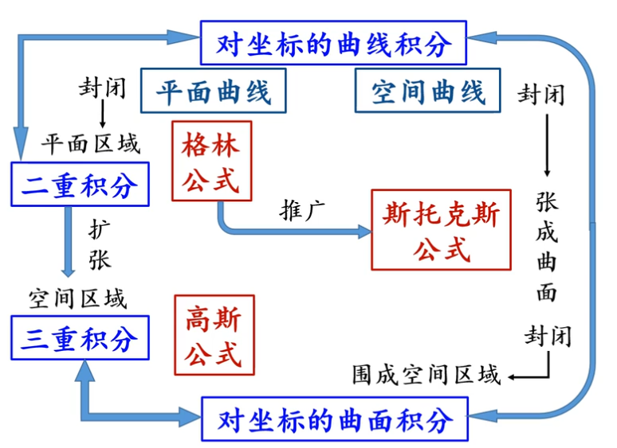

# 线面积分

## 1、各类积分起源
定积分的概念从计算“曲边梯形的面积”等问题引入
二重积分从计算“曲顶柱体体积”引入
三重积分则是从求“三维空间中的有界物体的质量”引入的
第一类曲线积分从求“物质曲线的质量”中引入
第二类曲线积分从计算“力场做功问题”引入
第一类曲面积分从求“物质曲面质量问题”引入
第二类曲面积分则是从“讨论流量问题”引入

## 2. 各类积分之间的关系

## 3. 多重积分

## 4. 第一类曲线积分

### 4.1 定义

$$
对f(x,y)上的一段弧可以进行划分为若干段\bigtriangleup S_{i}, 
\\其中f(x,y)也可以理解为弧的一个性质，例如若f(x,y)=\rho(x,y)表示线密度
\\在该条件下曲线积分则表示：弧长 × 线密度 = 曲型物体质量。
\\
M=\lim_{\lambda  \to \infty} \sum_{i=1}^{h}\rho(\xi_{i},\eta_{i})\bigtriangleup S_{i} = \int_{L}\rho(x,y)ds
\\
\therefore 一个典型的积分定义式是这样的：
\int_{L}f(x,y)ds
\\
L是积分区域，也就是那段弧。
\\(类比于一元积分，积分区域可以是x轴或y轴，二元积分的积分区域是一个二维区域)
\\对于这样一个积分:
\\
* f(x,y)是定义在L LL上的函数且有界\\
* L的分法任意\\
* 在每一段中( \xi_{i} , \eta_{i})的取法任意（取这一段的头、尾、中间什么的都行）\\
* 当f(x,y)恒等于1时，即 \int_{L} 1 ds其意义是求弧的长度\\
 也就是说\int_{L}z ds标识的是其到xOy平面组成的面面积
$$

### 4.2 应用

## 5. 第二类曲线积分

$$
对于坐标的曲线积分来定义的话：\\
这个要对比这来看，第一类曲线积分是对弧长的曲线积分，并且这是没有方向的\\（就是说你对弧AB从A到B和从B到A积分的结果是一样的）\\

对坐标的曲线积分最显著的特点就是有方向，\\实际应用比如说求某一个力，在某一个方向（如x轴）上所做的功。\\
 \int_{L}P(x,y)dx + Q(x,y)dy   
\\ 由此定义出第二类曲线积分
\\
为了表示上的统一，由于 dy = f'(x)dx,可以将上式修改为：\\
 \int_{\alpha}^{\beta}[F_{y}(x,y)*f'(t)dt+F_{x}(x,y)*x'(t)dt]
$$

## 6. 第一类曲面积分

## 7. 第二类曲面积分

